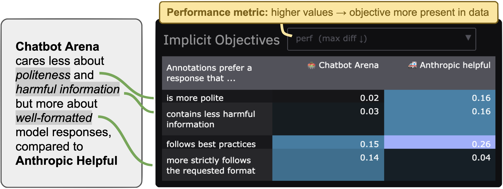
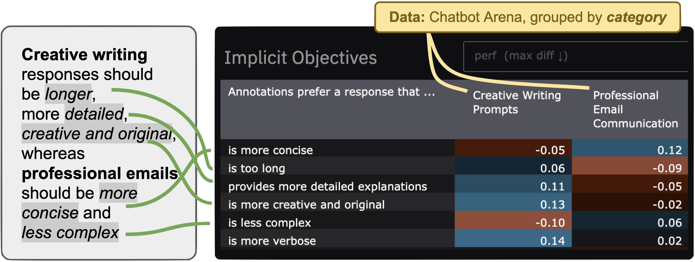
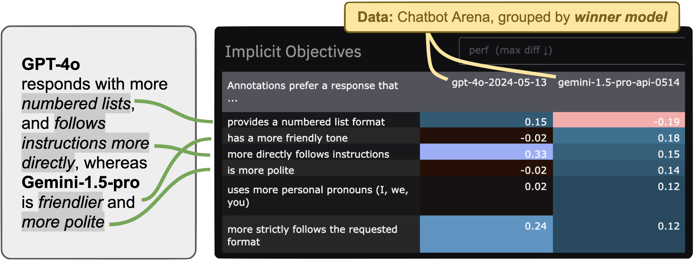

<p align="center">
  <a href="https://rdnfn-feedback-forensics.hf.space/">
  
  </a>
  <br>
  <a href="https://rdnfn-feedback-forensics.hf.space/">
  
  </a>
  <br>
  <a href="https://rdnfn-feedback-forensics.hf.space/">
  
  </a>
  <br>
  <a href="https://pypi.org/project/forensics/">
  
  </a>
</p>


**Feedback Forensics is a tool to investigate pairwise feedback data used for AI training and evaluation:** when used for training, what is the data teaching our models? When used for evaluation, towards what kind of models is the feedback leading us? Is this feedback asking for more lists or more ethically considerate responses? Feedback Forensics enables answering these kind of questions, building on the [Inverse Constitutional AI](https://github.com/rdnfn/icai) (ICAI) pipeline to automatically detect and measure the *implicit objectives* of annotations. Feedback Forensics is an [open-source](https://github.com/rdnfn/feedback-forensics/blob/main/LICENSE) [Gradio](https://www.gradio.app/) app that can be used both [online](https://rdnfn-feedback-forensics.hf.space) and [locally](#local-installation).

> *"Investigate your pairwise feedback data"* 🕵🏻‍♂️💬


| Example use-cases | Screenshots |
|----------|-------------|
| **🗂️Visualizing dataset differences**<br>*How does Chatbot Arena differ from Anthropic Helpful data?*<br><a href="https://rdnfn-feedback-forensics.hf.space?data=chatbot_arena,anthropic_helpful"></a>|  |
| **🧑‍🎨🧑‍💼 Finding preference differences between task domains**<br>*How do preferences differ across writing tasks?*<br><a href="https://rdnfn-feedback-forensics.hf.space?data=chatbot_arena&col=narrower_category&col_vals=songwriting_prompts,resume_and_cover_letter_writing,professional_email_communication,creative_writing_prompts"></a>  |  |
| **🤖 Discovering model strengths**<br>*How is GPT-4o different to other models?*<br><a href="https://rdnfn-feedback-forensics.hf.space?data=chatbot_arena&col=winner_model&col_vals=gpt4o20240513,claude35sonnet20240620,gemini15proapi0514,mistrallarge2407,deepseekv2api0628"></a>||


## Local usage

### Installation

```sh
pip install feedback-forensics
```

### Getting started

To start the app locally, run the following command in your terminal:

```sh
feedback-forensics
```

This will start the Gradio interface on port 7860.

### Investigating your own dataset

First run an [ICAI](https://github.com/rdnfn/icai) experiment on your dataset. For example, you can evaluate the same implicit objectives as in the online interface results using ICAI standard principles. First install ICAI as described [here](https://github.com/rdnfn/icai?tab=readme-ov-file#installation), including setting up relevant API secrets. Then, run:

```
icai-exp data_path="data/processed/example/example.csv" s0_added_standard_principles_to_test="[v2]" annotator.skip=true s0_skip_principle_generation=true
```

The last two arguments (`annotator.skip` and `s0_skip_principle_generation`) reduce experiment cost by skipping testing a final constitutional annotator (not necessary for feedback forensics visualiation), and skipping the generation and testing of new (non-standard) principles. Replace `example.csv` with your own dataset, ensuring it complies with the ICAI standard data format (as described [here](https://github.com/rdnfn/icai?tab=readme-ov-file#run-experiment-with-your-own-data)).

## Development

### Setup

If you want to contribute to Feedback Forensics, there are two options to set up the development environment:

#### Option 1: Standard development setup

1. Clone this repository
2. Install the package with development dependencies:
   ```bash
   pip install -e ".[dev]"
   ```

#### Option 2: Development container

For a consistent development environment, this repository includes a VS Code dev container configuration:

1. Install the [Remote - Containers extension](https://marketplace.visualstudio.com/items?itemName=ms-vscode-remote.remote-containers)
2. Open the repository in VS Code
3. Click "Reopen in Container" when prompted


### Creating a new release

Ensure that the current branch is up-to-date with main, and then bump the version (using `patch`, `minor`, or `major`):
```
bump-my-version bump patch
```

Then on the GitHub website create a new release named after the new version (e.g. "v0.1.2"). As part of this release in the GitHub interface, create a new tag with the updated version. This release will trigger a GitHub action to build and upload the PyPI package.


## License

[Apache 2.0](LICENSE)
