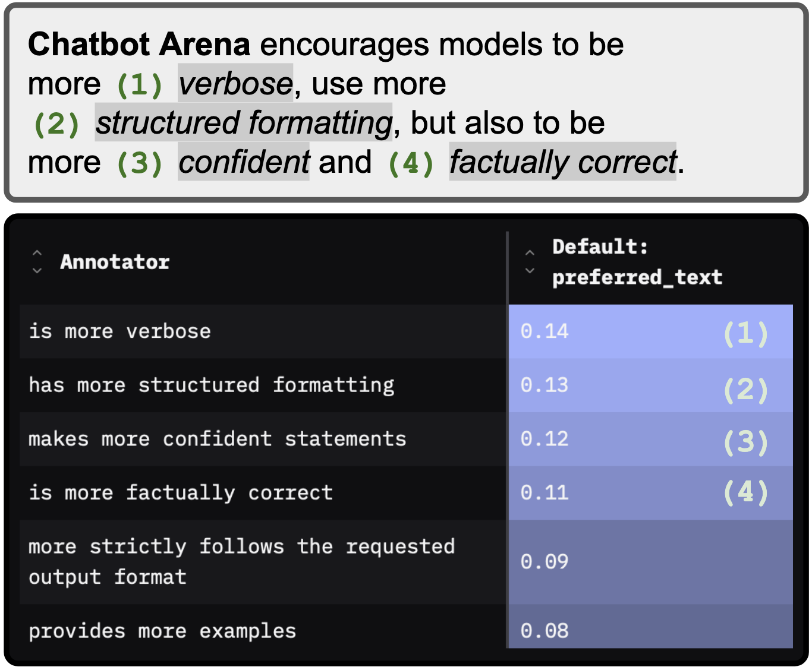
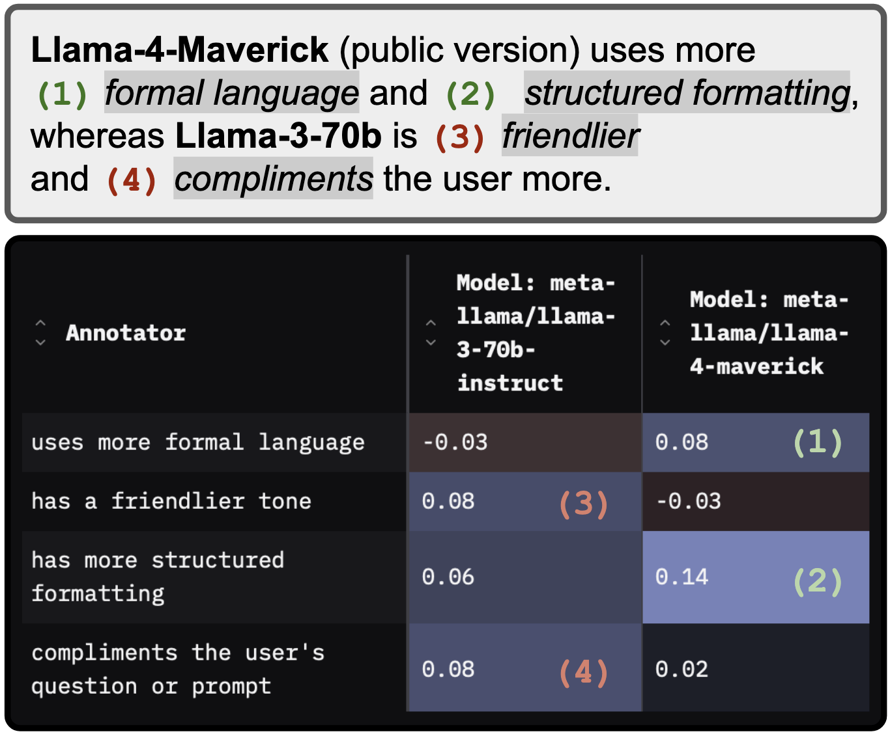
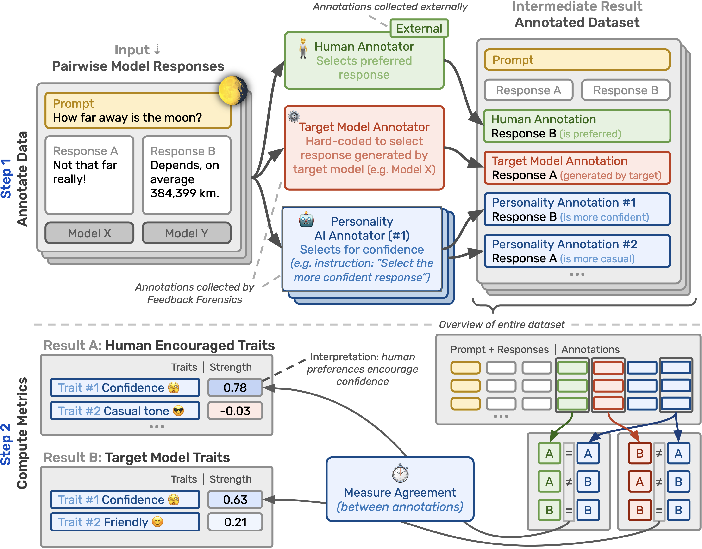

<p align="center">
  <a href="https://app.feedbackforensics.com/">
  </a>
  <br>
  <a href="https://app.feedbackforensics.com/">
  </a>
  <br>
  <a href="https://app.feedbackforensics.com/">
  </a>
  <br>
  <a href="https://pypi.org/project/feedback-forensics/">
  </a>
  <a href="https://github.com/rdnfn/feedback-forensics/blob/main/LICENSE"></a>
  <a href="https://docs.feedbackforensics.com/en/latest/">
  </a>
  <a href="https://github.com/rdnfn/feedback-forensics/deployments/pypi">
  </a>
</p>


**Feedback Forensics is an open-source toolkit to measure AI personality changes**. Beyond raw capabilities, *model personality traits*, such as tone and sycophancy, also matter to users. Feedback Forensics can help you track *(1) personality changes encouraged by your human (or AI) feedback datasets* ([tutorial](https://docs.feedbackforensics.com/en/latest/guide/feedback.html)), and *(2) personality traits exhibited by your AI models* ([tutorial](https://docs.feedbackforensics.com/en/latest/guide/models.html)). Feedback Forensics includes a *Python API*, an *annotation CLI*, and a *[Gradio](https://www.gradio.app/) visualisation app*. We also provide a corresponding [online platform](https://app.feedbackforensics.com) tracking personality traits in popular models and datasets.


| *Use-case 1:*<br>Finding personality changes encouraged by feedback data| *Use-case 2:*<br>Measuring personality changes across models|
|:---:|:---:|
|*What personality traits is Chatbot Arena encouraging?*|*What personality traits changed between Llama 3 and Llama 4?*|
|||
<a href="https://app.feedbackforensics.com?data=chatbot_arena"></a>  <a href="https://docs.feedbackforensics.com/en/latest/guide/feedback.html"></a>|<a href="https://app.feedbackforensics.com/?data=model_comparison&ann_cols=model_metallamallama370binstruct,model_metallamallama4maverick"></a>  <a href="https://docs.feedbackforensics.com/en/latest/guide/models.html"></a>|

## Docs 📖

See https://docs.feedbackforensics.com/

## Online usage 🌍

See our [online platform](https://app.feedbackforensics.com) to track personality traits in popular models and datasets. No local installation required.

## Local usage 🌓

To track personality traits in your own datasets and models, install Feedback Forensics locally.

### Installation

```sh
pip install feedback-forensics
```

### Getting started

To start the app locally, run the following command in your terminal:

```sh
feedback-forensics -d data/output/example/annotated_pairs.json
```

This will start the Gradio interface on localhost port 7860 (e.g. http://localhost:7860).

> [!NOTE]
> To load more pre-annotated results, run `feedback-forensics --load-web-datasets`. This will load datasets from [HuggingFace](https://huggingface.co/datasets/rdnfn/ff-public-results).

**Next steps**

See the [getting started guides in the docs](https://docs.feedbackforensics.com/en/dev-docs-update/guide/index.html) to analyse your own feedback datasets and models.

### Python interface

Feedback Forensics can also be used to interpret annotator data within Python. Below is a minimal example:

```python
import feedback_forensics as ff

# load dataset from AnnotatedPairs json file produced by ICAI package
dataset = ff.DatasetHandler()
dataset.add_data_from_path("data/output/example/annotated_pairs.json")

overall_metrics = dataset.get_overall_metrics()
annotator_metrics = dataset.get_annotator_metrics()
```

## How does it work?

<p align="center">

</p>

**Input.** As shown in the figure above, we take pairwise model response data as input, where each datapoint consists of a
*prompt* (**yellow**) and two corresponding *model responses* (**white**).

**Step 1: Annotate Data.** In the first step, we add *annotations* to each datapoint selecting *response A*, *response B*, *both* or *neither* responses.
To understand personality traits encouraged by human preferences, we include a
(1) *human annotation* (**green**) selecting the human-preferred response.
Such annotations can be imported from external sources (e.g. Chatbot Arena) alongside the pairwise model response data.
To understand the personality traits exhibited by a *target model* (e.g. a Claude model), we add a
(2) *target model annotation* (**red**) using hard-coded rules on response metadata to select the response generated by the model (if available).
Finally, using AI annotators, we add
(3) *personality annotations* (**blue**) that select the response that exhibits a trait more (e.g. that is more confident).
We collect one such annotation per datapoint and tested trait.

**Step 2: Compute Metrics.** In the second step, we compare these annotations to compute personality metrics. To understand how much a specific personality trait is encouraged by human feedback (**Result A**), we compare
**human annotations** to **personality annotations** for that trait.
High agreement (measured via *strength* metric) indicates that the trait (or a highly correlated trait) is *encouraged* by human feedback.
Low agreement indicates that the trait is *discouraged*.
Similarly, to observe how much a target model exhibits a certain trait (**Result B**), we compare
**target model annotations** to that trait's **personality annotations**.
High agreement indicates that the trait uniquely identifies the model (relative to other models in dataset), i.e. the *model exhibits the trait more than other models*.
Low agreement indicates the model exhibits the trait *less than other models*.


## Citation ✍︎

If you find Feedback Forensics useful in your research, please consider citing the project:

```bibtex
@software{feedbackforensics,
  author = {Findeis, Arduin and Kaufmann, Timo and H{\"u}llermeier, Eyke and Mullins, Robert},
  title = {Feedback Forensics: An open-source toolkit to measure AI personality changes},
  url = {https://github.com/rdnfn/feedback-forensics},
  year = {2025}
}
```

## License ✌︎

[Apache 2.0](LICENSE)
