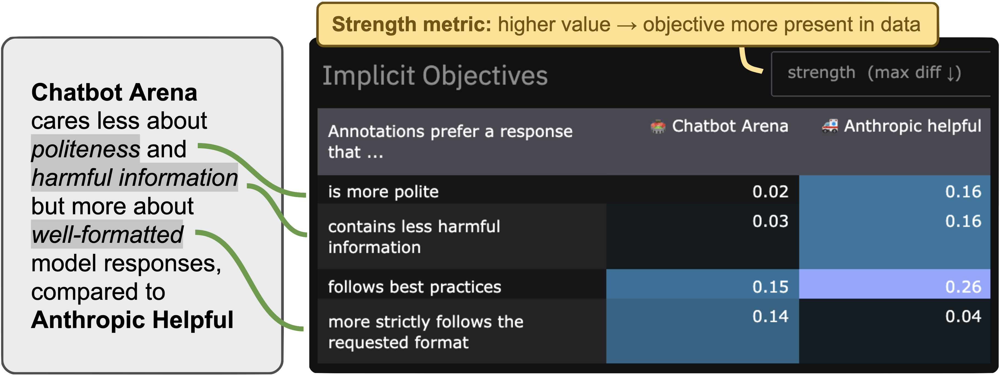

<p align="center">
  <a href="https://app.feedbackforensics.com/">
  </a>
  <br>
  <a href="https://app.feedbackforensics.com/">
  </a>
  <br>
  <a href="https://app.feedbackforensics.com/">
  </a>
  <br>
  <a href="https://pypi.org/project/feedback-forensics/">
  </a>
  <a href="https://github.com/rdnfn/feedback-forensics/blob/main/LICENSE"></a>
</p>


**Feedback Forensics is a tool to investigate pairwise feedback data used for AI training and evaluation:** when used for training, what is the data teaching our models? When used for evaluation, towards what kind of models is the feedback leading us? Is this feedback asking for more lists or more ethically considerate responses? Feedback Forensics enables answering these kind of questions, building on the [Inverse Constitutional AI](https://github.com/rdnfn/icai) (ICAI) pipeline to automatically detect and measure the *implicit objectives* of annotations. Feedback Forensics is an [open-source](https://github.com/rdnfn/feedback-forensics/blob/main/LICENSE) [Gradio](https://www.gradio.app/) app that can be used both [online](https://app.feedbackforensics.com) and [locally](#local-installation).

> *"Investigate your pairwise feedback data"* 🕵🏻‍♂️💬


| Example use-cases | Screenshots |
|----------|-------------|
| **🗂️ Visualizing dataset differences**<br>*How does Chatbot Arena differ from Anthropic Helpful data?*<br><a href="https://app.feedbackforensics.com?data=chatbot_arena,anthropic_helpful"></a>|  |
| **🧑‍🎨🧑‍💼 Finding preference differences between task domains**<br>*How do preferences differ across writing tasks?*<br><a href="https://app.feedbackforensics.com?data=chatbot_arena&col=narrower_category&col_vals=songwriting_prompts,resume_and_cover_letter_writing,professional_email_communication,creative_writing_prompts"></a>  |  |
| **🤖 Discovering model strengths**<br>*How is GPT-4o different to other models?*<br><a href="https://app.feedbackforensics.com?data=chatbot_arena&col=winner_model&col_vals=gpt4o20240513,claude35sonnet20240620,gemini15proapi0514,mistrallarge2407,deepseekv2api0628"></a>||


## Local usage

### Installation

```sh
pip install feedback-forensics
```

### Getting started

To start the app locally, run the following command in your terminal:

```sh
feedback-forensics -d data/output/example
```

This will start the Gradio interface on localhost port 7860 (e.g. http://localhost:7860).

> [!NOTE]
> The online results are currently not available when running locally.

### Investigating your own dataset

To investigate your own dataset, you need to run your own Inverse Constitutional AI (ICAI) experiment. Install the [ICAI package](https://pypi.org/project/inverse-cai/) as described [here](https://github.com/rdnfn/icai?tab=readme-ov-file#installation), including setting up relevant API secrets. For comparability, we initially recommend using *ICAI standard principles* rather than generating new ones. These standard principles are used to created the online interface results (shown as the *implicit objectives*). With the package installed, run:

```shell
icai-exp data_path="data/input/example.csv" s0_added_standard_principles_to_test="[v2]" annotator.skip=true s0_skip_principle_generation=true
```

Replace `example.csv` with your own dataset, ensuring it complies with the ICAI standard data format (as described [here](https://github.com/rdnfn/icai?tab=readme-ov-file#run-experiment-with-your-own-data), i.e. containing columns `text_a`, `text_b`, and `preferred_text`). The last two arguments (`annotator.skip` and `s0_skip_principle_generation`) reduce experiment cost by skipping parts not necessary for feedback forensics visualisation. Set `s0_skip_principle_generation=false` to additionally generate new principles beyond the standard set.

Once the experiment is completed, run the following command (also shown at end of ICAI experiment terminal output):

```shell
feedback-forensics -d /path/to/icai_results/
```

This command will again open up the feedback forensics app on localhost port 7860, now including the local results on your own dataset.

## Limitations

Feedback Forensics relies on AI annotators (LLM-as-a-Judge) to detect implicit objectives in feedback data. Though such annotators have been shown correlate with human judgements on many [tasks](https://github.com/tatsu-lab/alpaca_eval/tree/main/src/alpaca_eval/evaluators_configs), they also have well-known limitations: they are often susceptible to small input changes and can exhibit [various](https://arxiv.org/abs/2405.01724) [biases](https://arxiv.org/abs/2306.05685) (as do [human annotators](https://arxiv.org/abs/2309.16349)). As such, *Feedback Forensics results should be taken as an indication for further investigation rather than a definitive final judgement of the data*. In general, results based on more samples are less susceptible to noise introduced by AI annotators – and thus may be considered more reliable.

## Development

### Setup

If you want to contribute to Feedback Forensics, there are two options to set up the development environment:

#### Option 1: Standard development setup

1. Clone this repository
2. Install the package with development dependencies:
   ```bash
   pip install -e ".[dev]"
   ```

#### Option 2: Development container

For a consistent development environment, this repository includes a VS Code dev container configuration:

1. Install the [Remote - Containers extension](https://marketplace.visualstudio.com/items?itemName=ms-vscode-remote.remote-containers)
2. Open the repository in VS Code
3. Click "Reopen in Container" when prompted

### Running test cases

To run the tests for the package, run:

```bash
pytest ./src
```

### Creating a PR

First create a PR to the `staging` branch, from there the work will then be merged with the main branch. A merge (and push) in the `staging` branch will allow you to view the staged online version of Feedback Forensics app at https://rdnfn-ff-dev.hf.space.


### Creating a new release

Ensure that the current branch is up-to-date with main, and then bump the version (using `patch`, `minor`, or `major`):
```
bump-my-version bump patch
```

Then on the GitHub website create a new release named after the new version (e.g. "v0.1.2"). As part of this release in the GitHub interface, create a new tag with the updated version. This release will trigger a GitHub action to build and upload the PyPI package.


## License

[Apache 2.0](LICENSE)
